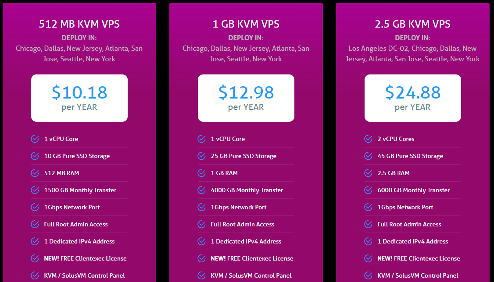

# 科学上网知识科普
Some information about proxy technologies.

提到科学上网，懂的人都懂。对于搞外贸的、搞技术研究的人等等是必不可少的。  
我们平时用的技术并不是VPN技术，准确地来讲是proxy技术，代理技术，将目标网站的内容获取后，加密传输给你，从而避开审查。  
代理的获取一般来讲主要有两种方式：
- 购买他人提供的proxy/VPN服务
- 自行搭建

主要的区别是：[代理(Proxy)和VPN的区别]( https://zhuanlan.zhihu.com/p/451193697)。  
简要总结一下就是：购买服务费钱，自已搭服务器费时间。  
以下表格是两种方式的优缺点对比，个人根据情况进行选择。  
<table border="1" align="center" >
	<tr>
		<td></td>
		<td align="center" >
			购买服务<br>
		</td>
        <td align="center">
			自已搭建<br>
		</td>
	</tr>
    <tr >
		<td>好处</td>
		<td>省时省心</td>
        <td>随心定制，不受限制，价格低</td>
	</tr>
    <tr >
		<td>缺点</td>
    <td>
			费钱！！<br>
			服务提供商良莠不齐，可能会有节点数量限制或带宽限制<br>
			有些服务商有安全隐患，会跑路，不自由<br>
		</td>
        <td>
			费时间！！<br>
			需要一定的技术基础，花费一定的时间<br>
			还要不定期进行技术升级<br>
		</td>
    </tr>
</table>

# 一、常用的VPN提供商
这些proxy服务提供商最重要的是服务质量和稳定性，以及是否提供退款保证。常用的值得推荐的几家包括：  
- 1.[justMysocks.net](https://justmysocks.net/members/aff.php?aff=24386) 由搬瓦工2018年推出。主要优点有两个：1、流量稳定靠谱。2、付款方便，支持银联卡、PayPal和支付宝。  
- 2.[ExpressVPN](https://www.expressvpn.com/) 30天退款保证。ExpressVPN全平台适用，使用体验也不错，遇到墙封锁之后恢复的也最快，一般一个星期内就会陆续出各平台的更新包，更新程序之后，官方推荐的线路就能恢复正常连接了，以往在敏感时期ExpressVPN会受到持续针对。  
- 3.[StrongVPN](https://www.strongvpn.com) --性价比最佳，2005年创立的老牌VPN，母公司是纳斯达克上市科技公司J2 Global.目前StrongVPN的价格在国外大厂VPN中算很便宜的，综合性价比高，支持支付宝付款。

创立时间不超过3年的VPN服务，建议大家谨慎选择。

# 二、自建proxy服务
## 1.总体技术路线
proxy服务提供的功能就是当你需要访问国外的某网站S时,提供中间的网络中继服务.
当你使用chrome浏览google.com时,不出意外地肯定是访问不了的,与chrome无关,用Edge也是一样的。
great firewall会教你做人。 此时，你需要一个中介来提供中继服务,这就是proxy。  
```
                       Great
    chrome           Firewall              google.com
  ┌────────┐            │                  ┌─────────┐
  │        ├─────────XXXXXXXXX────────────►│         │
  │        │            │                  │         │
  └────────┘            │                  └─────────┘

```
浏览器的请示交由proxy client，proxy client 向 proxy server发送请示，proxy server 向google.com发起请示，google.com回复的数据也是按原路返回最终chrome就可以浏览google了。
当然这中间凭什么你可以访问proxy server，因为这中间是有加密的，Great Firewall虽然知道这里面有数据发送，但无法知道其中是什么内容。

```
                proxy      Great       proxy
 chrome        client     Firewall    server        google.com
┌───────┐      ┌──────┐      │       ┌──────┐        ┌───────┐
│       ├─────►│      ├──────┼──────►│      ├───────►│       │
│       │      │      │      │       │      │        │       │
└───────┘      └──────┘      │       └──────┘        └───────┘
```
以前大家知道的和用的最多的proxy软件是shadowsocks，简称SS。但是经过SS与防火墙多年的反复对抗，SS已经被防火墙精准识别，现在SS一被使用，立马就会被封禁IP。SS是绝对不能用的。  
由于防火墙的作用是阻挡，不管你用什么协议，只要被盯上就避免不了被封的结局。像kcptun，一个没有代理功能的软件，现在也用不了了，被精准识别。（太多人用kcptun创建隧道套SS）    
目前还能使用的是基于SSL的一些技术，比如Trojan、Xray等等，基本方法是使用SSL作为连接的加密协议，与普通web浏览器所用的协议相同，导致防火墙难以区分到底是普通的web连接还是代理连接。  
从2022年10月开始，根据用户反馈，Trojan、Xray这类基于SSL的协议也会被识别从而被阻断，采用的是GPU人工智能分析的方法，当然加密的内容是不会被破解的，如果被破解了就是世界级大新闻。

而SSL与SS协议相比，需要用到域名、证书等，与SS相比部署难度提高了很多。
其他的proxy 协议，比如WireGuard，根据部分读者反映，WireGuard协议在中国国内使用不稳定，会出现显示连接却上不了网的情况，比较鸡肋。


那么自建proxy服务需要做的就是要完成以下几个步骤：
购买VPS -> 申请域名和证书  -> 部署proxy服务 -> 选择合适的客户端


## 2.VPS的选择
VPS提供商挺多的，新手最早看到的教程都是用[搬瓦工](https://bandwagonhost.com/aff.php?aff=56257)和[vultr](https://www.vultr.com/?ref=7621285)，搬瓦工最便宜也要49$/年，vultr更是需要60$/年。

[DMIT](https://www.dmit.io/)：  
自成立以来，DMIT便是土豪商家的代表，资费不便宜。今年7月DMIT收购HKServerSolution国际站部分业务后，成为CN2 GIA VPS的大鳄，CN2带宽充足（搬瓦工有时也会向DMIT购买带宽）。产品质量和稳定性都比较有保障，适合想省心不折腾的网友，本站目前也托管在此。季付、半年付、年付产品可使用DMIT优惠码 DMIT59CUGN 续费优惠5%。官网：https://www.dmit.io

[racknerd.com]( https://my.racknerd.com/aff.php?aff=3278)  
RackNerd，距今为止已成立3年，国外知名VPS平台,cheap VPS类票选的2020年TOP10商家，2021年度TOP3商家。因为其高性价比VPS的特色，以及迅速及时的工单服务，在国外和国内用户中热度都很高，知名度连年攀升。商家官网有繁体中文版，并支持国内的支付宝，微信，以及国外主流的PayPal、信用卡等付款方式。
前两年因为有传言说老板是跑路四大金刚，RackNerd是灵车，和RackNerd迅速蹿升的知名度伴随着的还有巨大的争议。不过由于这几年RackNerd持续稳定的服务，这类传言也逐渐销声匿迹。
点击[新年优惠](https://www.racknerd.com/NewYear/ )这个页面购买优惠的VPS。  
首页上最上面可能也会不定期展示优惠链接， 点击这样的优惠链接购买才划算。这个页面可能会随着时间变化，大家可以在网上搜索一下，用这样的优惠链接打开进行购买。   
国内需要购买位于 Los Angeles DC02的机子，因为速度针对国内有优化。
[](https://www.racknerd.com/NewYear/)


具体的步骤可以参考 [部署XRAY流程](./xray_deploy.md)   


## 3.选择合适的proxy客户端
不同的平台需要不同的客户端软件，vless+tls的配置
目前最常用的就是以下几种平台：我们整理了一个表格，提供各个平台的软件的下载。

| 平台      | 客户端                                                                                                              | 备注                     |
| ------- | ---------------------------------------------------------------------------------------------------------------- | ---------------------- |
| windows | [Qv2ray](https://github.com/Qv2ray/Qv2ray/releases),[v2rayN](https://github.com/2dust/v2rayN/releases) ,         | 很多协议都提供命令行运行的工具，将      |
| linux   | [Qv2ray](https://github.com/Qv2ray/Qv2ray/releases)                                                              | 很多协议都提供命令行运行的工具，可以直接运行 |
| macos   | [Qv2ray](https://github.com/Qv2ray/Qv2ray/releases), [V2RayXS](https://github.com/tzmax/v2rayXS/releases)        |                        |
| android | [v2rayNG](https://github.com/2dust/v2rayNG/releases), [igniter](https://github.com/trojan-gfw/igniter/releases), |                        |
| ios     | Shadowrocket(收费）,Pharos Pro ,                                                                                    | 需要注册一个外国区的AppleID      |

其他还有：  
Clash  
QuantumX  


[外区Apple Id申请教程](https://ssr.tools/104)


## 4.客户端的工作模式配置

客户端软件还提供不同的使用模式。
PAC、全局、不代理3种模式，区别在于：
- 直连模式： 就是直接连接，没有经过任何协议节点，和没开网络代理模式一样，相当于关闭网络代理。
- 全局模式: 意思是访问所有网站都走代理节点。这种模式访问国内网站速度略慢，并且耗费流量。
- PAC模式： 根据pac文件来判断访问时需不需要经过代理，较为智能，省流量。但是较为依赖pac规则，小众网站可能不经过代理，需要自己编辑规则，或者切换全局代理模式。

## 5.浏览器器配置
用的最多的也是浏览器，浏览器上需要安装proxySwitchyOmega插件，控制浏览器访问网络时从代理进行数据获取。
https://chrome.google.com/webstore/detail/proxy-switchyomega/padekgcemlokbadohgkifijomclgjgif

proxySwitchyOmega配置方法参见： https://proxy-switchyomega.com/settings/


## 6.一键部署流程
前面的申请证书、部署服务的流程虽然已经非常详细和简明了，但是对于一些小朋友来讲，还是过于复杂，希望更加简单的方法。那就是一些爱好者制作的一键脚本。直接一个脚本完成所有的流程so easy! 不过一键脚本有可能被暗藏挖矿木马，使用时请谨慎。这里列出几个，不能保证安全性。
- https://github.com/wulabing/Xray_onekey
- https://github.com/Jrohy/trojan


## 7.一些免费的节点
网友们在部署时可能会遇到先有鸡还是先有蛋的问题，就是当你要部署代理服务的时候，需要通过代理科学上网来实现。
此时可以先借用一下免费的节点完成工作，完成后再用自己的节点。
毕竟免费的节点使用的人太多，速度上会比较慢，并且一直在更新，也缺乏稳定性。

[freefq]( https://github.com/freefq/free)
可以使用以下地址进行订阅：
- https://raw.fastgit.org/freefq/free/master/v2
- https://ghproxy.com/https://raw.githubusercontent.com/freefq/free/master/v2

还可以查询这些站点获取免费节点：
https://free-ss.site/
https://github.com/aiboboxx/v2rayfree


# 三、更多的科学上网知识的相关链接

tlanyan 有一些部署方法的介绍 https://itlanyan.com/  
目前最重要的科学上网工具：Xray的官方文档 https://xtls.github.io/  
v2fly官方网站 https://www.v2fly.org/ 

讨论网络技术的论坛 https://github.com/net4people/bbs


# 四、科学网络技术主体工具

各种工具的对比

| 软件         | 支持的协议                    | 优点                     | 缺点            | 证书          | 备注             |
| :--------- | :----------------------- | :--------------------- | :------------ | :---------- | :------------- |
| xray       | vless,vmess,xtls,vision  | 基于tls的，更新及时            | 用的人太多，会被针对    | 需要          | 当前社区的主流工具      |
| naiveproxy | naive                    | 更新及时                   |               |             | 小众             |
| hysteria   | quic+obs                 | 基于                     | 基于UDP可能被Qos   | 需要          | 比较红            |
| tuic       | quic                     | 速度特别快                  | 暂时不支持tunnel模式 | 需要          | 小众             |
| kcptun     | kcp                      | 对丢包率高的线路有加速效果          | 被封            | 不需要         |                |
| gost       | tls,mtls,ss,kcp,quic,tcp | 协议类型多，支持proxy和tunnel模式 | quic速度慢       | 不需要（可以自己生成） | 用起来有点复杂，对小白不友好 |


xray,v2ray,v2fly   vless,vmess,
kcp 基于UDP的，也支持tcp模式，(only for linux) kcptun
hysteri  基于quic  需要证书
tuic 基于 quic   需要证书，只支持proxy 模式，不支持tunnel模式
gost 支持多种协议，ss,tls, wss, kcp,quic,h2, http...

shadowtls
navieproxy


速度对比：
tuic >  hyteria > tls(不被针对) > kcp > tls(被针对)


# 路由器
供一些不方便安装科学网络工具的设备进行透明上网。 （不需要进行配置，接入就可以上科学的网络）
硬件
R2S,。。。


软件
openwrt passwall2

# 技术走向
网络工具，与网络封锁技术，一直像猫鼠游戏一样在矛与盾的不断升级中向前进化，相受相杀。


# ❌不推荐购买或使用的VPN产品❌

1. Hola VPN：会强制使用用户的网絡作为他人的VPN连接设备。
2. Urban VPN：同Hola，同样使用用户网絡。
3. Panda VPN(熊猫VPN)：疑似中资，有安全性风险。
4. Plex加速器：和Panda VPN同个公司。
5. 快连VPN，也是高机率中资而且隐私条款很危险。
6. 小牛VPN：可能钓鱼。
7. Opera浏览器内置VPN：360公司可以控制，安全性无法确认。
8. Express VPN：来自香港，有中资背景。
9. Easy VPN：中资。
10. Itop VPN：中资。
11. 老王VPN：可能钓鱼。
12. 蚂蚁VPN：可能钓鱼，經過其他群組的用戶回饋，也可能不是釣魚。
13. UFO VPN：可能中资和钓鱼。
14. Turbo VPN：可能中資(地址是新加坡)，也可能釣魚。
15. VPN Monster：和Turbo VPN同公司。
16. pure vpn：來自香港。
17. Ivacy VPN:：可能和pure vpn同個公司。
18. ipvanish：曾分享用戶資料給美國政府，現在和express vpn屬於同一個公司。
19. zenmate vpn：和express vpn同一個公司。
20. cyberghost vpn：同上。
21. pia vpn：同上。
22. Hotspot Shield：中資，而且服務條款說可能賣廣告。
23. touch vpn：和Hotspot Shield同個公司。
24. better net vpn：同上，而且之前有看過別人使用這款被安裝廣告和挖礦。
25. 卡巴斯機vpn：使用22~24公司的服務合作，而且公司來自俄羅斯，安全性無法控制。
26. golden flog vypr vpn：疑似來自伊朗。
27. 自由門：低安全性。
28. 蘭燈：低安全性。
29. 佛跳牆：低安全性。 


