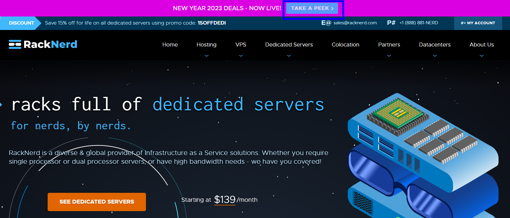

# proxycn
Some information about proxy technologies.

提到科学上网，懂的人都懂。对于搞外贸的、搞技术研究的人等等是必不可少的。
科学上网的原理及介绍： introduce

常用的技术并不是VPN技术，准确地来讲是proxy技术，代理技术，将目标网站的内容获取后，加密传输给你，从而避开审查。
一般来讲主要有两种方式，一种是购买他人提供的proxy/VPN服务，一种是自行搭建proxy
购买成熟的服务费钱，自已搭服务器费时间。
[代理(Proxy)和VPN的区别]( https://zhuanlan.zhihu.com/p/451193697)  
以下表格是两种方式的优缺点对比，个人根据情况进行选择。  
<table border="2" align="center" >
	<tr>
		<td></td>
		<td align="center" >
			购买现成的服务<br>
		</td>
        <td align="center">
			自建Proxy服务<br>
		</td>
	</tr>
    <tr >
		<td>好处</td>
		<td>省时省心</td>
        <td>随心定制，不受限制，价格低</td>
	</tr>
    <tr >
		<td>缺点</td>
    <td>
			费钱<br>
			服务提供商良莠不齐，可能会有节点数量限制或带宽限制<br>
			不自由<br>
		</td>
        <td>
			费时间<br>
			需要一定的技术基础，并且花费一定的时间<br>
			还要不定期进行技术升级<br>
		</td>
    </tr>
</table>

# 一、常用的VPN提供商
这些proxy服务提供商最重要的是服务质量和稳定性，以及是否提供退款保证。常用的包括：  
-1.[justMysocks.net](https://justmysocks.net/members/aff.php?aff=24386) 由搬瓦工2018年推出。主要优点有两个：1、流量稳定靠谱。2、付款方便，支持银联卡、PayPal和支付宝。  
- 2.[ExpressVPN](https://www.expressvpn.com/) 30天退款保证  
- 3.[StrongVPN](https://www.strongvpn.com) 


# 二、自建proxy服务
## 1.总体技术路线
proxy服务提供的功能就是当你需要访问国外的某网站S时,提供中间的网络中继服务.
当你使用chrome浏览google.com时,不出意外地肯定是访问不了的,与chrome无关,用Edge也是一样的。
great firewall会教你做人。 此时，你需要一个中介来提供中继服务,这就是proxy。  
```
                       great
    chrome           firewall              google.com
  ┌────────┐            │                  ┌─────────┐
  │        ├─────────XXXXXXXXX────────────►│         │
  │        │            │                  │         │
  └────────┘            │                  └─────────┘

```
浏览器的请示交由proxy client，proxy client 向 proxy server发送请示，proxy server 向google.com发起请示，google.com回复的数据也是按原路返回最终chrome就可以浏览google了。
当然这中间凭什么你可以访问proxy server，因为这中间是有加密的，great firewall虽然知道这里面有数据发送，但无法知道其中是什么内容。

```
                proxy      great       proxy
 chrome        client     firewall    server        google.com
┌───────┐      ┌──────┐      │       ┌──────┐        ┌───────┐
│       ├─────►│      ├──────┼──────►│      ├───────►│       │
│       │      │      │      │       │      │        │       │
└───────┘      └──────┘      │       └──────┘        └───────┘
```
以前大家知道的和用的最多的proxy软件是shadowsocks，简称SS。但是经过SS与防火墙多年的反复对抗，SS已经被防火墙精准识别，现在谁还用SS立马就会被封禁IP。所以SS是绝对不能使用的。
由于防火墙的作用是阻挡，不管你用什么协议，只要被盯上就避免不了被封的结局。像kcptun，一个没有代理功能的软件，现在也用不了了，被精准识别。（太多人用kcptun创建隧道套SS）  
目前还能使用的是基于SSL的一些技术，比如Trojan、V2ray等等，基本方法是使用SSL作为连接的加密协议，与普通web浏览器所用的协议相同，导致防火墙难以区分到底是普通的web连接还是代理连接。  
而SSL与SS协议相比，需要用到域名、证书等，与SS相比部署难度提高了很多。
其他的proxy 协议，比如WireGuard，根据部分读者反映，WireGuard协议在中国国内使用不稳定，会出现显示连接却上不了网的情况，比较鸡肋。


那么自建proxy服务需要做的就是要完成以下几个步骤：
购买VPS -> 申请域名和证书  -> 部署proxy服务 -> 选择合适的客户端
下面我们就分别介绍这几个步骤。


## 2.VPS的选择
VPS提供商挺多的，新手最早看到的教程都是用[搬瓦工](https://bandwagonhost.com/aff.php?aff=56257)和[vultr](https://www.vultr.com/?ref=7621285)，搬瓦工最便宜也要49$/年，vultr更是需要60$/年。

[DMIT](https://www.dmit.io/)：自成立以来，DMIT便是土豪商家的代表，资费不便宜。今年7月DMIT收购HKServerSolution国际站部分业务后，成为CN2 GIA VPS的大鳄，CN2带宽充足（搬瓦工有时也会向DMIT购买带宽）。产品质量和稳定性都比较有保障，适合想省心不折腾的网友，本站目前也托管在此。季付、半年付、年付产品可使用DMIT优惠码 DMIT59CUGN 续费优惠5%。官网：https://www.dmit.io，购买建议参考：DMIT服务器购买和使用教程；

[racknerd.com]( https://my.racknerd.com/aff.php?aff=3278)  
RackNerd，距今为止已成立3年，国外知名VPS平台,cheap VPS类票选的2020年TOP10商家，2021年度TOP3商家。因为其高性价比VPS的特色，以及迅速及时的工单服务，在国外和国内用户中热度都很高，知名度连年攀升。商家官网有繁体中文版，并支持国内的支付宝，微信，以及国外主流的PayPal、信用卡等付款方式。
前两年因为有传言说老板是跑路四大金刚，RackNerd是灵车，和RackNerd迅速蹿升的知名度伴随着的还有巨大的争议。不过由于这几年RackNerd持续稳定的服务，这类传言也逐渐销声匿迹。
点击[黑色星期五优惠](https://www.racknerd.com/BlackFriday/ )这个页面购买优惠的VPS。 首页上最上面可能也会不定期展示优惠链接， 点击这样的优惠链接购买才划算。这个页面可能会随着时间变化，大家可以在网上搜索一下，用这样的优惠链接打开进行购买。
[](https://www.racknerd.com/NewYear/)


## 3.申请域名和证书
这里只讲免费的域名如何申请，收费的域名就不说了。  
    1.freenom.com  
在这个网站上可以申请.tk  .cf 等后缀的免费域名，申请方法参考这个链接：[申请方法](https://zhujitips.com/328)  
   2.还有一些提供免费进行域名解析网站  
  它们的作用是不需要申请，直接将你的VPS的IP放在他们的域名前面，会自动解析到你的这个IP地址。比如：  1.2.3.4.sslip.io 将被自动解析到1.2.3.4这个IP地址，非常好用。  
 - https://sslip.io/
 - https://nip.io/
  
***证书申请***：
证书用来进行网站验证和通信加密。 我们需要为域名申请一个真实的 TLS 证书，使网站具备标准 TLS 加密的能力及 HTTPS 访问的能力， Xray 等proxy工具进行加密的工具。
证书申请大家都用acme.sh。命令如下，使用时需要将具体的域名替换成你需要的域名。
```
#运行安装脚本
wget -O -  https://get.acme.sh | sh
#让 acme.sh 命令生效
. .bashrc
#开启 acme.sh 的自动升级
acme.sh --upgrade --auto-upgrade
# 申请证书
# zerossl跟letsencrypt 一样的
./acme.sh  --issue --server zerossl -d example.com  -d www.example.com --standalone  -m yourname@gmail.com
```
在正式申请证书之前，可以先用测试命令(--issue --test)来验证是否可以成功申请，这样可以避免在本地配置有误时，反复申请证书失败，超过 Let's Encrypt 的频率上限（比如，每小时、每个域名、每个用户失败最多 5 次），导致后面的步骤无法进行。
下载的证书位于/root/.acme.sh/example.com/目录下。  
主要有2个文件，一个是example.com.key是私钥，一个是fullchain.cer这里面就是证书啦。
acme.sh 会每 60 天检查一次证书并自动更新临期证书。

完整的过程示例：


## 4.部署proxy服务 
ss不要再使用了，包括SSR也不要再用。
kcptun也不能使用了。

这里介绍xray的部署，xray是在v2ray的基础上发展起来的代理工具，支持当前多种代理协议，且有庞大和活跃的支持团队。  

v2ray基础上有2个团队的产品更新比较及时，分别是以下2种，由于XTLS团队更活跃，我们以这个为示例。  
- Project X团队搞的xray： https://github.com/XTLS/Xray-core  
- v2fly团队搞的v2ray： https://github.com/v2fly/v2ray-core  

XTLS团队提供了一个示例配置库，引导小白进行配置，https://github.com/XTLS/Xray-examples
注意并不是每一个配置都可以用，有些比如VLESS-TCP就不安全，推荐采用下面2个
- VLESS-TCP-TLS-WS (recommended)
- VLESS-TCP-TLS
这里只介绍VLESS-TCP-TLS，VLESS相比VMESS更简单易用，单用VLESS不安全，必须套TLS。
server.json
下面的配置文件里面只需要修改带有“//”注释的行。
- uuid可以点击此链接生成：https://uuid.900cha.com/
- serverName 改成具体的域名
- certificateFile和keyFile 对应前面申请的证书，使用绝对路径
```
{
    "log": {
        "loglevel": "warning"
    },
    "inbounds": [
        {
            "listen": "0.0.0.0",
            "port": 443,
            "protocol": "vless",
            "settings": {
                "clients": [
                    {
                        "id": "",//generate a id 
                        "level": 0,
                        "email": "abc@example.com"
                    }
                ],
                "decryption": "none",
                "fallbacks": [
                    {
                        "dest": 8001
                    },
                    {
                        "alpn": "h2",
                        "dest": 8002
                    }
                ]
            },
            "streamSettings": {
                "network": "tcp",
                "security": "tls",
                "tlsSettings": {
                    "serverName": "example.com",//domain
                    "alpn": [
                        "h2",
                        "http/1.1"
                    ],
                    "certificates": [
                        {
                            "certificateFile": "/path/to/fullchain.crt", //certfile
                            "keyFile": "/path/to/private.key"    //private key
                        }
                    ]
                }
            }
        }
    ],
    "outbounds": [
        {
            "protocol": "freedom",
            "tag": "direct"
        }
    ]
}
```
客户端也在原有的内容上进行一些修改：
- adress 可以用IP，也可以用域名
- id 前面生成的uuid
- serverName 用域名
client.json
```
{
    "log": {
        "loglevel": "warning"
    },
    "inbounds": [
        {
            "listen": "127.0.0.1",
            "port": "1080",// 这个端口是客户端代理监听的端口， 需要用到
            "protocol": "socks",
            "settings": {
                "auth": "noauth",
                "udp": true,
                "ip": "127.0.0.1"
            }
        },
        {
            "listen": "127.0.0.1",
            "port": "1081",
            "protocol": "http"
        }
    ],
    "outbounds": [
        {
            "protocol": "vless",
            "settings": {
                "vnext": [
                    {
                        "address": "1.2.3.4",// ip or domain
                        "port": 443,
                        "users": [
                            {
                                "id": "",//uuid 
                                "encryption": "none",
                                "level": 0
                            }
                        ]
                    }
                ]
            },
            "streamSettings": {
                "network": "tcp",
                "security": "tls",
                "tlsSettings": {
                    "serverName": "example.domain",//domain
                    "allowInsecure": false,
                    "alpn": [
                        "h2",
                        "http/1.1"
                    ],
                    "disableSessionResumption": true
                }
            },
            "tag": "proxy"
        },
        {
            "protocol": "freedom",
            "tag": "direct"
        }
    ],
    "routing": {
        "domainStrategy": "AsIs",
        "rules": [
            {
                "type": "field",
                "ip": [
                    "geoip:private"
                ],
                "outboundTag": "direct"
            }
        ]
    }
}

```
其他可用于部署的软件和方法不再列出，有些是基于QUIC协议，但UDP容易被Qos，有些是在原有协议的基础上增加SSL，大家可以自行搜索。
- ShadowsocksR-native
- hysteria 
- tuic 
- Shadowsocks 2022

## 5.选择合适的proxy客户端并配置
不同的平台需要不同的客户端软件，vless+tls的配置
目前最常用的就是以下几种平台：我们整理了一个表格，提供各个平台的软件的下载。
- windows
- linux
- macos
- android
- ios

| 平台      | 客户端                                                                                                              | 备注                     |
| ------- | ---------------------------------------------------------------------------------------------------------------- | ---------------------- |
| windows | [Qv2ray](https://github.com/Qv2ray/Qv2ray/releases),[v2rayN](https://github.com/2dust/v2rayN/releases) ,         | 很多协议都提供命令行运行的工具，将      |
| linux   | [Qv2ray](https://github.com/Qv2ray/Qv2ray/releases)                                                              | 很多协议都提供命令行运行的工具，可以直接运行 |
| macos   | [Qv2ray](https://github.com/Qv2ray/Qv2ray/releases), [V2RayXS](https://github.com/tzmax/v2rayXS/releases)        |                        |
| android | [v2rayNG](https://github.com/2dust/v2rayNG/releases), [igniter](https://github.com/trojan-gfw/igniter/releases), |                        |
| ios     | Shadowrocket(收费）,Pharos Pro ,                                                                                    | 需要注册一个外国区的AppleID      |


[apple id申请](https://ssr.tools/104)


客户端的配置：

客户端软件还提供不同的使用模式。
PAC、全局、不代理3种模式，区别在于：
- 直连模式： 就是直接连接，没有经过任何协议节点，和没开网络代理模式一样，相当于关闭网络代理。
- 全局模式: 意思是访问所有网站都走代理节点。这种模式访问国内网站速度略慢，并且耗费流量。
- PAC模式： 根据pac文件来判断访问时需不需要经过代理，较为智能，省流量。但是较为依赖pac规则，小众网站可能不经过代理，需要自己编辑规则，或者切换全局代理模式。

用的最多的也是浏览器，建议在浏览器上安装proxySwitchyOmega插件，控制浏览器访问网络时从代理进行数据获取。
https://chrome.google.com/webstore/detail/proxy-switchyomega/padekgcemlokbadohgkifijomclgjgif

proxySwitchyOmega配置方法参见： https://proxy-switchyomega.com/settings/


## 6.一键部署流程
前面的申请证书、部署服务的流程虽然已经非常详细和简明了，但是对于一些小朋友来讲，还是过于复杂，希望更加简单的方法。那就是一些爱好者制作的一键脚本。直接一个脚本完成所有的流程so easy! 不过一键脚本有可能被暗藏挖矿木马，使用时请谨慎。这里列出几个，不能保证安全性。
- https://github.com/wulabing/Xray_onekey
- https://github.com/Jrohy/trojan


## 7.一些免费的节点
网友们在部署时可能会遇到先有鸡还是先有蛋的问题，就是当你要部署代理服务的时候，需要通过代理科学上网来实现。
此时可以先借用一下免费的节点完成工作，完成后再用自己的节点。
毕竟免费的节点使用的人太多，速度上会比较慢，并且一直在更新，也缺乏稳定性。

[freefq]( https://github.com/freefq/free)
可以使用以下地址进行订阅：
- https://raw.fastgit.org/freefq/free/master/v2
- https://ghproxy.com/https://raw.githubusercontent.com/freefq/free/master/v2

还可以查询这些站点获取免费节点：
https://free-ss.site/
https://github.com/aiboboxx/v2rayfree


# 三、更多的科学上网知识的相关链接

tlanyan 有一些部署方法的介绍 https://itlanyan.com/
  
目前最重要的科学上网工具：Xray的官方文档 https://xtls.github.io/

v2fly官方网站 https://www.v2fly.org/ 

讨论网络技术的论坛 https://github.com/net4people/bbs


